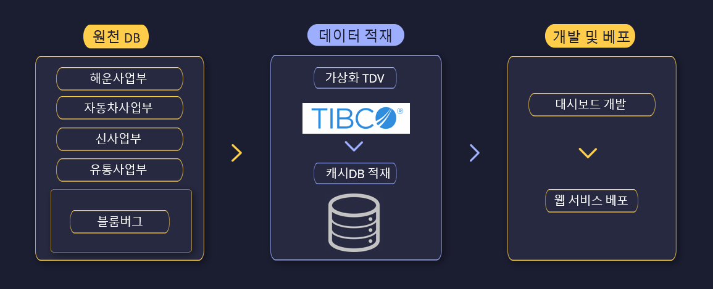

## 프로젝트 요약

- ERP 다원화 데이터에서 핵심 KPI를 표준화하고, 실시간에 가까운 대시보드로 의사결정을 지원한 프로젝트입니다.
- 역할: 데이터 모델링, ETL/전처리, TDV 데이터 통합, Tableau 설계·구현, 성능 최적화, 권한/배포.

## 배경과 목표

- 부서별로 분산된 ERP 테이블과 지표 정의가 상이해 공용 KPI 체계가 필요했습니다.
- 목표
  - KPI 정의 표준화와 단일 진실원천(SSOT) 확립
  - 운영 지표의 실시간 모니터링과 셀프서비스 분석 지원

## 아키텍처 개요

- 소스: ERP/운영 DB → 추출(SQL) → TDV 통합/정제 → KPI 모델
- 서비스: KPI 모델 → Tableau 데이터소스 → 대시보드(권한 기반 뷰)
- 갱신: 중요 지표 증분 처리, 고빈도 지표 단축 주기 갱신

## 주요 작업

- 데이터 모델링: 지표 사전(KPI Dictionary) 작성, 원천 필드-지표 매핑, SCD 처리 설계
- ETL/정제: TDV 기반 조인·집계 파이프라인 구성, 누락/이상값 처리 규칙 수립
- 대시보드: 역할별(운영/관리자) 레이아웃과 드릴다운 흐름 정의, 사용성 반복 실험
- 성능 최적화: 핵심 쿼리 인덱스 보강 및 프리컴퓨트 도입(응답 수 초 → 1초대)
- 운영/거버넌스: 데이터소스 권한 체계, 리프레시 스케줄, 변경 이력 문서화

## 성과

- KPI 용어/산식 표준화로 보고서 간 불일치 해소
- 주간 리포트 작성 시간 평균 60% 단축(수작업 → 자동화)
- 증분 적재·프리컴퓨트로 피크 시간대 쿼리 부하 40% 이상 감소

## 기술 스택

- 데이터 통합: **TDV**, `SQL`
- 시각화/서비스: **Tableau**(데이터소스 권한, 프로젝트 구조, 추출 리프레시)
- 운영: 배치 스케줄, 지표 사전/변경 이력 문서화

## 회고

- KPI·품질 규칙을 선합의한 뒤 개발에 착수하니 재작업이 크게 줄었습니다.
- Tableau 데이터소스/프로젝트 구조 표준화가 운영 비용을 낮췄습니다.
